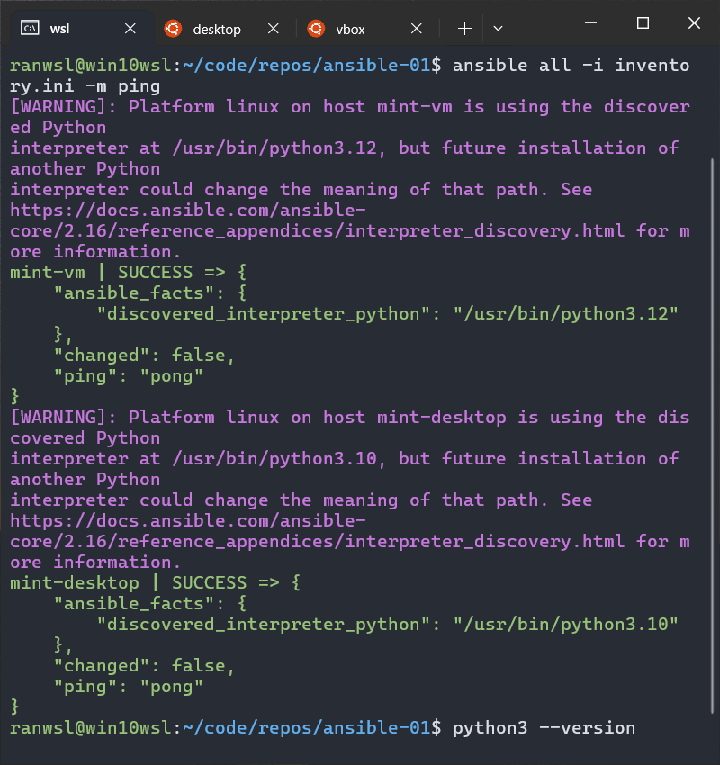

# ansible-01

## Basic Inventory & Ad-Hoc Commands

## **Project Overview**

This project sets up an Ansible inventory file and demonstrates running ad-hoc commands on remote Linux Mint machines.

---

## **Step 1: Setting Up SSH Key Authentication**

To enable password-less SSH access, follow these steps:

### **1. Generate an SSH Key on WSL**

```bash
ssh-keygen -t rsa -b 4096 -C "ansible@wsl"
```

Press **Enter** to accept the default file location (`~/.ssh/id_rsa`).
Do **not** set a passphrase (press Enter twice).

### **2. Copy the Key to the Managed Nodes**

Replace `user` and `ip_address` with your actual details:

```bash
ssh-copy-id user@ip_address
```

Repeat this for each Linux Mint machine.

If `ssh-copy-id` is unavailable, manually copy the key:

```bash
cat ~/.ssh/id_rsa.pub
```

On the remote machine, add the key to `~/.ssh/authorized_keys`:

```bash
echo "PASTE_THE_KEY_HERE" >> ~/.ssh/authorized_keys
chmod 600 ~/.ssh/authorized_keys
```

### **3. Test SSH Access**

```bash
ssh user@ip_address
```

If the login works without a password, SSH key authentication is set up.

---

## **Step 2: Create an Ansible Inventory File**

Create an `inventory.ini` file in the project directory:

```ini
[linux_mint]
mint-desktop ansible_host=192.168.1.10 ansible_user=user
mint-vm ansible_host=192.168.1.20 ansible_user=user
```

Replace IP addresses and usernames with your actual setup.

---

## **Step 3: Test Ansible Connection**

Run the following command to check connectivity:

```bash
ansible all -i inventory.ini -m ping
```

If successful, each host will return a `pong` response.



---

## **Step 4: Running Ad-Hoc Commands**

Execute remote commands without writing a playbook:

1.**Check system uptime:**

```bash
ansible linux_mint -i inventory.ini -m shell -a "uptime"
```

2.**Check disk usage:**

```bash
ansible linux_mint -i inventory.ini -m shell -a "df -h"
```

3.**List logged-in users:**

```bash
ansible linux_mint -i inventory.ini -m shell -a "who"
```
